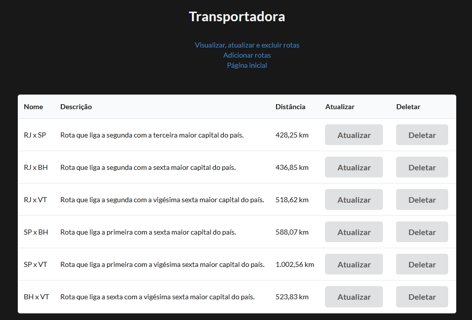

# Sendo servido - Transportadora

Projeto em grupo do terceiro módulo do curso de WebDev Full Stack da Resilia. Nele desenvolvemos uma página para consumir (CRUD) uma API criado no projeto individual do mesmo módulo.

## Tecnologias usadas
- HTML, CSS e JavaScript
- React com Vite
- Axios
- Semantic UI 
- ReactDOM e React Router 

## Endpoints do servidor
- planos
- rotas
- veiculos

## Execução
```
# Clone o repositório
git clone <https://github.com/mcristhian/Projeto-em-Grupo-M-03.git>

# Instale as dependências
npm i

# Execute
npm run dev

# Acesse o localhost
<http://localhost:5173/>
```

# Tela de visualização das rotas
